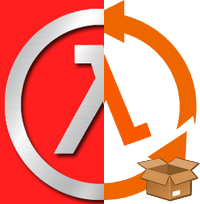

<div align="center">
    <p>
      
    </p>
    <p>
      <a href="README.md"> English</a> — <a href="README-es_ES.md"> Español</a>
    </p>
</div>

# HLDS Pack (ReHLDS + AmxModX + Metamod-r)

This is a complete pack for a Half-life dedicated server that include:

- Base files getted from Steam.
- [ReHLDS](https://github.com/dreamstalker/rehlds) (from [this Docker Image](https://github.com/dapize/rehlds))
- [AMX Mod X](https://github.com/alliedmodders/amxmodx/tree/1.9-dev) ever latest version.
- [Metamod-r](https://github.com/theAsmodai/metamod-r) ever latest version.

## How use it?

Importing the commands from the father image...

```
docker run -d --name my-hlds-server\
 -p 26900:26900/udp\
 -p 27020:27020/udp\
 -p 27015:27015/udp\
 -p 27015:27015\
 -e SERVER_NAME="My HLDS Pack Server"\
 -e START_MAP="crossfire"\
 -e MAXPLAYERS="32"\
 -e RCON_PASSWORD="secret"\
 dapize/hlds-pack:latest
```

**_and that's it!_**

> the files are located in: /opt/hlds

## If you use docker-compose

Can use the example writed in the docker-compose file:

```
version: "2"
services:
  rehlds:
    image: dapize/hlds-pack:latest
    environment:
      SERVER_NAME: "My HLDS Pack Server"
      START_MAP: "crossfire"
      MAXPLAYERS: "32"
      RCON_PASSWORD: "secret"
    ports:
      - 26900:26900/udp
      - 27020:27020/udp
      - 27015:27015/udp
      - 27015:27015/tcp
```

## 📚 Do you need help?

Let me know if have some doubt

## 🧾 License

The code and documentation are published under the [Mit License](LICENSE).
